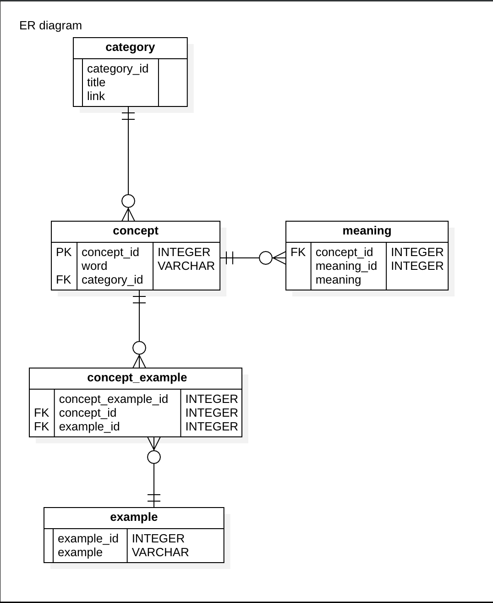

# MyEnglishStudyApp 프로젝트

~~~
3월 13일 토익 시험 예정
평범하게 공부하기 싫다.. 취약한 문법 부분에 대해 참신하게 공부하고 싶다.
~~~

그렇게 만들게 된 영어 공부 프로젝트로 App 을 만들 플랜을 가져본다.

### 개념적 설계

### 제작 목표
- 엑셀을 사용하지 않고 바로바로 DB로 저장할 수 있게 만들기
- DB가 엎어질 수 있으니, Excel로 백업할 수 있게 만들기
- 로그인 기능 구현
- CommonData 의 활용
- SOLID 를 살려 확장가능성 높게 만들기
- 단어별로 예문 개수를 만들어주는 통계? => 추후 Writing 공부하면 예문만들기용
- 카테고리별로 단어 보여주기
- 미리 vue로 view 프론트 만들기